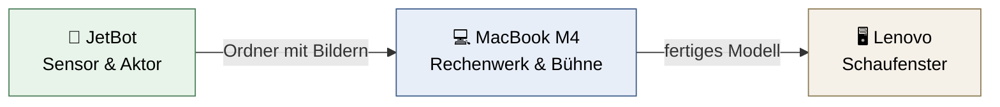
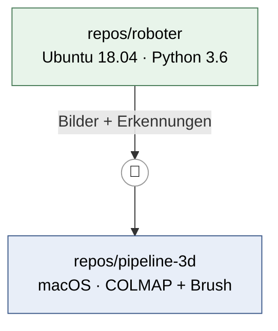
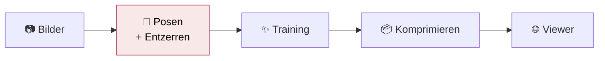

# Anwendungsvision

> Wie sich das Projekt anfühlt, wenn es läuft — für Menschen geschrieben. Die knappe strategische Fassung steht in VISION.md, die Begründungen in state/decisions/.

---

## In einem Satz

**Ein kleiner Roboter fährt durch einen Raum, und auf dem Bildschirm daneben wächst dieser Raum als begehbares 3D-Modell aus dem Nichts zusammen.**

---

## Was du siehst und tust

### 🎮 Auf dem Tisch

Der JetBot steht eingeschaltet im WLAN. Auf dem Mac hast du **zwei Fenster** offen.

**Fenster 1 — der Roboter.** Ein Browser-Tab zeigt sein Kamerabild live. Du steuerst ihn und schaust dabei durch seine Augen. Das ist der Moment, in dem sich das Projekt zum ersten Mal nach Robotik anfühlt — und er kostet fast keine Arbeit, weil das aufgespielte Image genau dieses Notebook mitbringt.

Du fährst eine Runde durch den Raum. An jeder Station hält der Roboter kurz an, das Bild beruhigt sich, ein Foto fällt. Dann weiter.

**Dann ein Befehl auf dem Mac.** Die Bilder wandern herüber, und ein, zwei Minuten lang passiert scheinbar nichts Aufregendes: der Rechner sucht heraus, wo die Kamera bei jeder einzelnen Aufnahme stand.

### ✨ Fenster 2 — der Moment, für den ihr das macht

Brush öffnet sein Viewer-Fenster.

| Zeitpunkt | Was du siehst |
|---|---|
| Sekunde 0 | Eine formlose Wolke aus farbigen Klecksen |
| Sekunde 10 | Grob erkennbar: Wände sind Wände, dunkle Flächen sind Möbel |
| Minute 1 | Kanten werden scharf, Texturen tauchen auf |
| Minute 10 | Ein Raum, durch den du fliegen kannst |

Und das Entscheidende: **während das läuft, kannst du mit der Maus durch den halbfertigen Raum navigieren.** Das ist kein Fortschrittsbalken — du siehst der Rekonstruktion beim Entstehen zu.

### 📱 Am Ende

Ein Befehl dampft das Ergebnis auf ein Fünfzehntel ein. Der Raum, durch den der Roboter gerade gefahren ist, öffnet sich im Browser — und später, wenn ihr wollt, auf jedem Handy im Kurs.

---

## Wer macht was

| | Aufgabe | Ausdrücklich **nicht** |
|---|---|---|
| 🤖 **JetBot** | Fahren, aufnehmen, Bild streamen, später Objekte erkennen | Posen schätzen, 3D-Training |
| 💻 **MacBook** | Posen, 3D-Training mit Live-Viewer, Konvertierung | Den Roboter in Echtzeit steuern |
| 🖥️ **Lenovo** | Den fertigen Viewer ausliefern | Irgendetwas rechnen |

> **Faustregel:** Die Grenze ist *Latenz*, nicht Rechenleistung. Was in unter 100 ms reagieren muss, läuft auf dem Roboter. Alles andere auf dem Mac.

---

## Zwei Baustellen, die sich kaum berühren

Das Projekt besteht aus **zwei getrennten Entwicklungen**, die parallel laufen und sich an genau einer Stelle treffen: einem Ordner mit Bildern.

**Warum getrennt?** Verschiedene Betriebssysteme, verschiedene Python-Versionen, verschiedene Fehlerbilder. Zusammengelegt würden beide Seiten Kompromisse eingehen, von denen keine profitiert. Getrennt lässt sich jede Seite **einzeln vorführen** — der fahrende Roboter ist eine Demo, das wachsende 3D-Modell ist eine zweite.

Die Schnittstelle ist bewusst dumm: ein Ordner, kein Protokoll, keine gemeinsame Bibliothek.

---

## „Modell" heißt hier zwei völlig verschiedene Dinge

Das ist die wichtigste begriffliche Falle im ganzen Projekt.

### 🏠 Das 3D-Modell — gar kein maschinelles Lernen

Trotz des Wortes „Training" **lernt hier nichts**. Es ist eine Optimierung.

Das Modell besteht aus hunderttausenden winzigen, durchscheinenden 3D-Ellipsoiden — „Gauß-Klecksen". Jeder hat Position, Größe, Ausrichtung, Farbe, Durchsichtigkeit. Mehr nicht.

> **Training heißt hier:** Rendere die Wolke aus einer bekannten Kameraposition → vergleiche mit dem echten Foto → schiebe jeden Kleks ein Stück in Richtung „weniger Unterschied". Dann das nächste Foto. Acht- bis dreißigtausend Mal.

| | |
|---|---|
| **Was es am Ende macht** | Nichts. Es *ist* der Raum. |
| **Wo es funktioniert** | Ausschließlich in **diesem einen Raum** |
| **Das Ziel** | Fotorealistisch durch einen echten Raum fliegen |
| **Der Bonus** | Die Optimierung ist *sichtbar* — das ist euer Präsentations-Kern |

### 🧠 Das Fahr- und Erkennungsmodell — echtes maschinelles Lernen

Hier stimmt die klassische Aufteilung.

| | |
|---|---|
| **Eingang** | Das Kamerabild |
| **Ausgang** | Eine Entscheidung — „frei"/„blockiert", oder „das ist ein Stuhl" |
| **Trainiert** | Einmal, auf dem Mac (oder vortrainiert heruntergeladen) |
| **Läuft** | Viele Male pro Sekunde, auf dem Roboter |
| **Was es kann** | **Verallgemeinern** — auch auf Situationen, die es nie gesehen hat |

Das ist der ganze Unterschied: Das 3D-Modell kennt einen Raum perfekt und sonst nichts. Das Fahrmodell kennt keinen Raum, aber es kommt mit jedem zurecht.

---

## Die Pipeline — und wo sie bricht

Der rot markierte Schritt ist die **Sollbruchstelle**.

Die Posen-Schätzung muss für jedes Bild herausfinden, *wo* die Kamera stand und *wohin* sie zeigte. Sie scheitert an:

- 🌫️ **unscharfen Bildern** — der häufigste Fall
- 🧱 **texturlosen weißen Wänden** — es braucht wiedererkennbare Punkte
- 🪞 **Spiegeln, Glas, glänzenden Böden**
- 🔁 **sich wiederholenden Mustern**
- 🚶 **Dingen, die sich während der Aufnahme bewegt haben**

> ⚠️ **Das Tückische:** Sie scheitert oft ohne Fehlermeldung. Du bekommst plausibel aussehende, aber falsche Positionen — und merkst es erst am verschmierten Endergebnis.

**Und was danach kommt, kann das nicht reparieren.** Falsche Posen werden als Unschärfe ins Modell eingebacken. Deshalb entscheidet sich die Qualität bei der *Aufnahme*, nicht bei der Verarbeitung.

### Wofür die Methode grundsätzlich ungeeignet ist

| Ungeeignet für | Warum |
|---|---|
| Spiegelndes und Durchsichtiges | Sieht aus jeder Richtung anders aus → schwebende Artefakte |
| Bewegte Objekte | Widersprechen sich zwischen den Aufnahmen |
| Messungen | Das Modell hat keinen echten Maßstab |
| **Blickwinkel weit weg von der Kamerabahn** | Dort war nie eine Aufnahme — und genau das ist beim bodennahen Roboter das Thema |

---

## Was danach möglich wird

- 🏷️ **Objekte mit Ort.** Der Roboter erkennt Stuhl, Tisch, Monitor — und die Labels landen an der richtigen Stelle im 3D-Modell. Man klickt sie im Browser an.
- 🧭 **Die gefahrene Bahn im Modell.** Als Linie eingezeichnet: der Weg des Roboters durch den Raum, den er selbst aufgenommen hat. Kostet fast nichts, weil die Positionen ohnehin berechnet werden.
- 🤖 **Selbstständiges Fahren** statt gesteuert.
- 🎯 **Die Kür:** Der Roboter fährt gezielt dorthin, wo das 3D-Modell noch löchrig ist. Dann greifen beide Projekthälften ineinander.

---

## Die ehrlichen Grenzen

| Grenze | Auswirkung |
|---|---|
| Kamera 10 cm über dem Boden, alles in einer Ebene | Artefakte, sobald man diese Ebene verlässt |
| Rolling-Shutter-Kamera bei Innenraumlicht | Unschärfe während der Fahrt |
| Jetson Nano, ~0,5 TFLOPS, Software von 2021 | Nur kleine, ältere Modelle auf dem Roboter |
| MacBook Air ohne Lüfter | Drosselt bei Dauerlast |
| Kein CUDA-Rechner | Der Großteil des 3D-Ökosystems fällt aus |
| Lenovo mit ~9 MBit/s Upload | Kein Hörsaal lädt dort gleichzeitig |

Keine davon verhindert das Projekt. Alle zusammen erklären, warum der Plan so aussieht, wie er aussieht.
