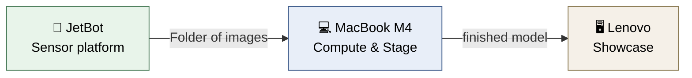
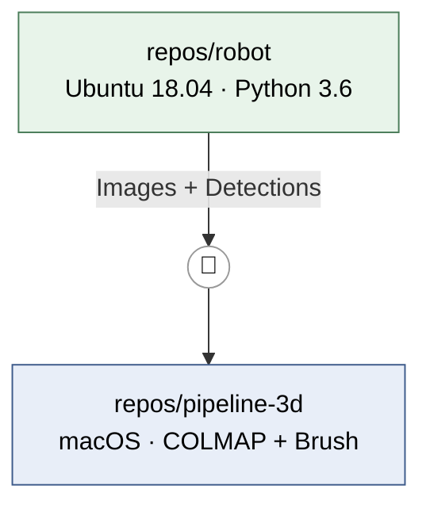
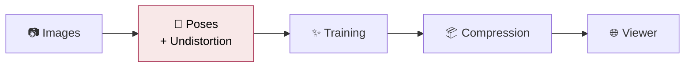

# Application Vision

> How the project feels when it's running — written for humans. The concise strategic version is in VISION.md, the reasoning in state/decisions/.

---

## In one sentence

**A small robot drives through a room, and on the screen next to it, this room emerges out of nowhere as a walkable 3D model.**

---

## What you see and do

### 🎮 On the table

The JetBot is turned on and connected to the Wi-Fi. On the Mac you have **two windows** open.

**Window 1 — the robot.** A browser tab shows its live camera feed. You steer it and look through its eyes while doing so. This is the moment the project feels like robotics for the first time — and it takes almost no work, because the flashed image provides exactly this notebook.

You drive a lap around the room. At every station the robot stops briefly, the image settles, a shot is taken. Then onwards.

**Then a command on the Mac.** The images are transferred, and for a minute or two seemingly nothing exciting happens: the computer figures out where the camera was located for every single shot.

### ✨ Window 2 — the moment you are doing this for

Brush opens its viewer window.

| Time | What you see |
|---|---|
| Second 0 | A shapeless cloud of colored splats |
| Second 10 | Roughly recognizable: walls are walls, dark areas are furniture |
| Minute 1 | Edges become sharp, textures appear |
| Minute 10 | A room you can fly through |

And the crucial part: **while this is running, you can navigate through the half-finished room with your mouse.** This is not a progress bar — you are watching the reconstruction emerge.

### 📱 At the end

A command compresses the result to a fifteenth of its size. The room the robot just drove through opens in the browser — and later, if you want, on every phone in the course.

---

## Who does what

| | Task | Explicitly **not** |
|---|---|---|
| 🤖 **JetBot** | Drive, capture, stream image, later object detection | Pose estimation, 3D training |
| 💻 **MacBook** | Poses, 3D training with live viewer, conversion | Steer the robot in real time |
| 🖥️ **Lenovo** | Serve the finished viewer | Compute anything |

> **Rule of thumb:** The boundary is *latency*, not compute power. Whatever must react in under 100 ms runs on the robot. Everything else on the Mac.

---

## Two construction sites that barely touch

The project consists of **two separate developments** that run in parallel and meet in exactly one place: a folder of images.

**Why separate?** Different operating systems, different Python versions, different error patterns. Merged together, both sides would make compromises that benefit neither. Kept separate, each side can be **demonstrated individually** — the driving robot is one demo, the growing 3D model is a second one.

The interface is deliberately dumb: a folder, no protocol, no shared library.

---

## "Model" means two completely different things here

This is the most important conceptual trap in the whole project.

### 🏠 The 3D model — no machine learning at all

Despite the word "training", **there is no learning here**. It is an optimization.

The model consists of hundreds of thousands of tiny, translucent 3D ellipsoids — "Gaussians" or "splats". Each has a position, size, orientation, color, opacity. Nothing more.

> **Training here means:** Render the cloud from a known camera position → compare with the real shot → nudge each splat a bit towards "less difference". Then the next shot. Eight to thirty thousand times.

| | |
|---|---|
| **What it does in the end** | Nothing. It *is* the room. |
| **Where it works** | Exclusively in **this one room** |
| **The goal** | Fly photorealistically through a real room |
| **The bonus** | The optimization is *visible* — this is your presentation core |

### 🧠 The driving and detection model — real machine learning

Here the classic division holds.

| | |
|---|---|
| **Input** | The camera image |
| **Output** | A decision — "free"/"blocked", or "that is a chair" |
| **Trained** | Once, on the Mac (or downloaded pre-trained) |
| **Runs** | Many times a second, on the robot |
| **What it can do** | **Generalize** — even to situations it has never seen |

That is the whole difference: The 3D model knows one room perfectly and nothing else. The driving model knows no room, but it can handle any.

---

## The pipeline — and where it breaks

The step marked in red is the **single point of failure**.

Pose estimation has to figure out for every image *where* the camera was and *where* it was pointing. It fails on:

- 🌫️ **blurry images** — the most common case
- 🧱 **textureless white walls** — it needs recognizable points
- 🪞 **mirrors, glass, shiny floors**
- 🔁 **repeating patterns**
- 🚶 **things that moved during the capture**

> ⚠️ **The tricky part:** It often fails without an error message. You get plausible-looking but wrong positions — and only notice it in the smeared final result.

**And what comes after cannot fix it.** Wrong poses are baked into the model as blurriness. That's why the quality is decided during *capture*, not during processing.

### What the method is fundamentally unsuited for

| Unsuited for | Why |
|---|---|
| Reflective and transparent things | Looks different from every direction → floating artifacts |
| Moving objects | Contradict themselves between shots |
| Measurements | The model has no real scale |
| **Angles far away from the camera trajectory** | There never was a shot there — and that is exactly the issue with a robot close to the floor |

---

## What becomes possible afterwards

- 🏷️ **Objects with a location.** The robot detects a chair, table, monitor — and the labels end up in the right place in the 3D model. You click them in the browser.
- 🧭 **The driven trajectory in the model.** Drawn as a line: the path of the robot through the room, which it captured itself. Costs almost nothing, because the positions are computed anyway.
- 🤖 **Autonomous driving** instead of being steered.
- 🎯 **The grand finale:** The robot drives purposefully to where the 3D model still has holes. Then both project halves interlock.

---

## The honest limits

| Limit | Impact |
|---|---|
| Camera 10 cm above the floor, everything in one plane | Artifacts as soon as you leave this plane |
| Rolling-shutter camera in indoor lighting | Blurriness during the drive |
| Jetson Nano, ~0.5 TFLOPS, software from 2021 | Only small, older models on the robot |
| MacBook Air without a fan | Throttles under sustained load |
| No CUDA machine | The majority of the 3D ecosystem drops out |
| Lenovo with ~9 Mbit/s upload | No lecture hall will load there simultaneously |

None of these prevent the project. All of them together explain why the plan looks the way it does.
